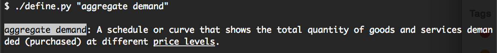
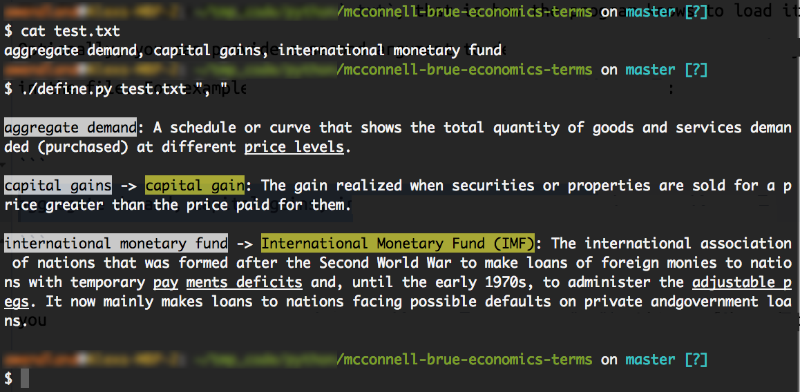

# McConnell Brue Macroeconomics Glossary
Python program for defining macroeconomics terms using the McConnell Brue Economics textbook. This program allows for searching the glossary and supports fuzzy-matching (every search will return a term, whichever is the closest). There are two ways to use this program:

### 1. Terms as arguments
Executing `define.py` followed by a list of terms is the simplest way to get a glossary definition.

`./definy.py TERM_1 "TERM_WITH_SPACES_2" TERM_3`

For example, running `./define.py "aggregate demand"` would return:



### 2. Lookup from file
Another method is to create a delimited file of the terms that you would like defined.

`./definy.py FILE_NAME.txt`

The file must have the extension `.txt`, that is how the program knows to load it. Optionally, you can provide a second argument to denote the term delimiter that you used in the file. For example, to define the terms in the following file:

```
aggregate demand, capital gains, international monetary fund
```

you would execute the command `./define.py FILE_NAME.txt ", "`. This would produce the output:



This argument setup looks like `./definy.py FILE_NAME.txt OPTIONAL_DELIMITER="\n"`. If you provide no second argument for the delimiter, the program will default to `\n`, newlines as the delimiter.

### Fuzzy Match

You'll notice that `international monetary fund -> International Monetary Fund (IMF)` appears. This is because there was no direct match for `international monetary fund`. What the program found instead was `International Monetary Fund (IMF)` because that was the closest match in the glossary.

Every search using this program will return a result. If the result is less than `97%` similar to the search than the above arrowing-matching format will be displayed.